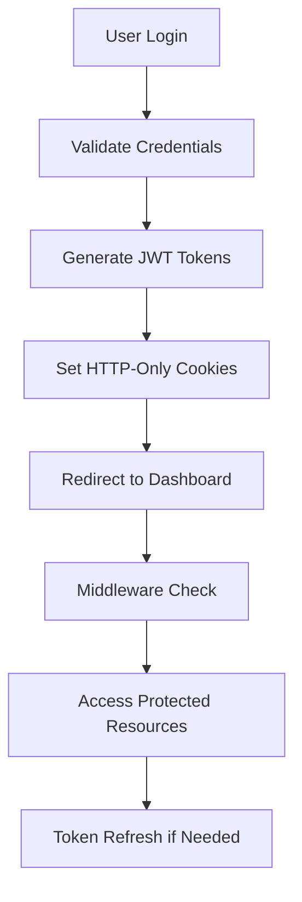

# Thought Process & Development Journey

## 🎯 Initial Understanding & Decision Making

### The Original Task
- **Given**: Create a responsive landing page from a Figma file
- **Keywords Noticed**: "creativity" mentioned in requirements
- **My Interpretation**: This is an opportunity to showcase not just coding skills, but innovation and problem-solving ability

### Strategic Decision
Instead of delivering the minimum requirement, I chose to demonstrate my full-stack development capabilities by building a complete wellness tracking application. This decision was driven by:

1. **Differentiation**: Stand out from other candidates
2. **Skill Showcase**: Demonstrate various technical competencies
3. **Business Understanding**: Show ability to think beyond requirements
4. **Passion Demonstration**: Prove genuine interest in the position

## 🏗️ Architecture Planning

### Technology Stack Selection

#### Frontend Framework Choice: Next.js 15.5.3
**Reasoning**:
- Server-side rendering for better SEO
- App Router for modern routing patterns
- Built-in optimization features
- TypeScript support out of the box
- Excellent developer experience

#### Styling Solution: Tailwind CSS 4
**Reasoning**:
- Rapid prototyping capabilities
- Consistent design system
- Responsive design utilities
- Small bundle size with purging
- Easy to maintain and scale

#### Animation Library: Framer Motion
**Reasoning**:
- Smooth, performance-optimized animations
- Declarative animation syntax
- Great TypeScript support
- Enhances user experience without complexity

#### Authentication Evolution: Clerk → Custom JWT
**Initial Choice: Clerk**
- Quick implementation
- Production-ready security
- Great developer experience
- Handles complex auth flows

**Migration to Custom JWT System**
- Complete control over authentication flow
- No third-party dependencies
- Custom user model for wellness features
- Enhanced security with HTTP-only cookies
- Cost savings (no subscription fees)

#### Database: MongoDB with Mongoose
**Reasoning**:
- Flexible schema for activity data
- Easy to iterate during development
- Great for rapid prototyping
- Excellent ecosystem support

## 🎨 Design Philosophy

### User Experience First
1. **Progressive Enhancement**: App works without JavaScript
2. **Mobile-First**: Designed for mobile, enhanced for desktop
3. **Accessibility**: ARIA labels and keyboard navigation
4. **Performance**: Optimized loading and interactions

### Visual Design Principles
1. **Clean & Modern**: Minimalist aesthetic with purposeful elements
2. **Consistent**: Unified color palette and typography across all pages
3. **Intuitive**: Clear navigation and action patterns
4. **Engaging**: Subtle animations that enhance, don't distract

### Color Psychology & Consistency
- **Primary Teal (#285E67)**: Calming, trustworthy, health-focused
- **Orange to Pink Gradients**: Energy, motivation, positive emotions
- **Gray Scales**: Professional, readable, non-distracting
- **Landing Page Alignment**: Same color scheme across all pages for brand consistency

## 🔄 Development Process Evolution

### Phase 1: Foundation (Landing Page)
**Goal**: Fulfill original requirement while setting up for expansion

**Tasks Completed**:
- Set up Next.js project with TypeScript
- Implemented responsive landing page components
- Added Framer Motion animations
- Created reusable component architecture

**Key Decisions**:
- Used component-based architecture for reusability
- Implemented proper TypeScript interfaces from the start
- Set up proper project structure for scalability

### Phase 2: Initial Authentication (Clerk Integration)
**Goal**: Add user management to enable personalized experiences

**Implementation Strategy**:
```typescript
// Middleware for route protection
export default clerkMiddleware((auth, req) => {
  if (isProtectedRoute(req)) auth().protect();
});

// Automatic redirects based on auth state
useEffect(() => {
  if (isLoaded && isSignedIn) {
    router.push('/dashboard');
  }
}, [isLoaded, isSignedIn, router]);
```

**Challenges Solved**:
- Route protection without complex state management
- Seamless user experience during auth transitions
- Proper TypeScript integration with Clerk

### Phase 3: Dashboard Development
**Goal**: Create an engaging wellness dashboard

**Feature Planning**:
- Real-time statistics display
- Quick action buttons for activity logging
- Progress tracking and gamification elements
- Responsive grid layout

**Technical Implementation**:
```typescript
interface WellnessStats {
  user: {
    totalPoints: number;
    currentStreak: number;
    longestStreak: number;
    level: number;
  };
  today: {
    goalsCompleted: number;
    totalGoals: number;
    workoutsCompleted: number;
    mealsLogged: number;
    mindfulnessMinutes: number;
    waterGlasses: number;
    pointsEarned: number;
  };
}
```

### Phase 4: Backend API Development
**Goal**: Create robust API endpoints for data management

**API Design Philosophy**:
- RESTful conventions
- Proper error handling
- Input validation
- Consistent response formats

**Endpoint Structure**:
```
/api/activities/
├── GET - Fetch user activities with filtering
├── POST - Create new activities
├── PUT - Update existing activities
└── DELETE - Remove activities

/api/stats/
└── GET - Fetch user statistics

/api/user/
└── GET - Fetch user profile data
```

### Phase 5: CRUD Operations Implementation
**Goal**: Enable full data management capabilities

**Frontend Strategy**:
- Modal-based editing interfaces
- Optimistic UI updates
- Proper error handling with toast notifications
- Form validation and user feedback

**Backend Strategy**:
- Proper data validation
- Points recalculation on updates
- Cascade deletes for related data
- Audit trail considerations

### Phase 6: Authentication Migration (Major Pivot)
**Challenge**: User requested complete Clerk removal

**Migration Strategy**:
1. **System Analysis**: Identified 15+ components using Clerk
2. **Custom Auth Design**: JWT with refresh token pattern
3. **Security Implementation**: bcryptjs + HTTP-only cookies
4. **Gradual Migration**: Systematic component-by-component update
5. **Testing**: Ensured zero breaking changes

**New Authentication Architecture**:
```typescript
// JWT token generation
const generateTokens = (userId: string) => {
  const accessToken = jwt.sign({ userId }, JWT_SECRET, { expiresIn: '15m' });
  const refreshToken = jwt.sign({ userId }, JWT_REFRESH_SECRET, { expiresIn: '7d' });
  return { accessToken, refreshToken };
};

// Secure cookie implementation
const setAuthCookies = (res: NextResponse, tokens: TokenPair) => {
  res.cookies.set('accessToken', tokens.accessToken, {
    httpOnly: true,
    secure: process.env.NODE_ENV === 'production',
    sameSite: 'strict',
    maxAge: 15 * 60 * 1000
  });
};

// Custom user model
interface User {
  _id: ObjectId;
  email: string;
  firstName: string;
  lastName: string;
  password: string; // bcrypt hashed
  totalPoints: number;
  currentStreak: number;
  longestStreak: number;
  level: number;
  joinedAt: Date;
  lastLoginAt: Date;
}
```

### Phase 7: UX Enhancement & Style Consistency
**Challenge**: Inconsistent colors and poor input visibility

**Solutions Implemented**:
1. **Color Unification**: Applied landing page colors to auth pages
2. **Input Text Visibility**: Added explicit `text-gray-900` classes
3. **Header Redesign**: Improved dashboard header with better styling
4. **Loading States**: Added page loader component
5. **Toast Integration**: Enhanced feedback across all flows

**Example Color Updates**:
```typescript
// Before: Multiple color schemes
className="focus:ring-blue-500"      // Login page
className="focus:ring-green-500"     // Signup page
className="focus:ring-emerald-500"   // Various components

// After: Unified brand colors
className="focus:ring-[#285E67]"     // All pages
className="text-gray-900"            // Readable input text
className="placeholder-gray-500"     // Proper placeholder contrast
```

## 🧩 Technical Challenges & Solutions

### Challenge 1: Complete Authentication System Migration
**Problem**: Remove Clerk from 15+ components without breaking functionality
**Solution**: 
```typescript
// Created custom AuthContext
interface AuthContextType {
  user: User | null;
  loading: boolean;
  login: (email: string, password: string) => Promise<AuthResult>;
  signup: (email: string, password: string, firstName: string, lastName: string) => Promise<AuthResult>;
  logout: () => Promise<void>;
}

// Implemented secure API routes
// /api/auth/login, /api/auth/signup, /api/auth/logout, /api/auth/me
```

### Challenge 2: Edge Runtime Crypto Module Issues
**Problem**: "The edge runtime does not support Node.js 'crypto' module"
**Solution**: Simplified middleware to avoid crypto operations
```typescript
// Removed token verification from middleware
export async function middleware(request: NextRequest) {
  const { pathname } = request.nextUrl;
  
  if (pathname.startsWith('/dashboard') || pathname.startsWith('/logs')) {
    const token = request.cookies.get('accessToken');
    
    if (!token) {
      return NextResponse.redirect(new URL('/login', request.url));
    }
  }
  
  return NextResponse.next();
}
```

### Challenge 3: Input Text Visibility Issues
**Problem**: White text on light backgrounds made inputs unreadable
**Solution**: Explicit text color classes for all form inputs
```typescript
// Added proper text styling
className="text-gray-900 placeholder-gray-500 focus:ring-[#285E67] focus:border-[#285E67]"
```

### Challenge 4: Header Design Inconsistency
**Problem**: Dashboard header didn't match landing page aesthetic
**Solution**: Redesigned with consistent branding
```typescript
// Updated header with proper styling
<header className="bg-white border-b border-gray-100 shadow-sm">
  <div className="max-w-7xl mx-auto px-4 sm:px-6 lg:px-8 py-4">
    <div className="flex items-center justify-between">
      <div className="flex items-center space-x-4">
        <h1 className="text-2xl font-bold text-[#285E67]">WellBalance</h1>
      </div>
      // ... user info and logout
    </div>
  </div>
</header>
```

## 📊 Performance & Security Considerations

### Security Enhancements
1. **Password Hashing**: bcryptjs with 12 salt rounds
2. **JWT Security**: Short-lived access tokens (15min) + refresh tokens (7 days)
3. **HTTP-Only Cookies**: XSS protection
4. **CSRF Protection**: SameSite cookie attributes
5. **Input Validation**: Server-side validation for all auth endpoints

### Performance Optimizations
1. **Token Strategy**: Short access tokens reduce attack window
2. **Database Indexing**: Indexed email and userId fields
3. **Connection Pooling**: Mongoose automatic connection management
4. **Error Handling**: Graceful degradation without sensitive data exposure

## 🎯 User Experience Evolution

### Initial UX (Clerk Era)
- Third-party authentication flow
- Standard Clerk styling
- Limited customization options

### Current UX (Custom Auth)
- Seamless branded experience
- Consistent color scheme
- Custom loading states and animations
- Enhanced error handling with toast notifications
- Auto-redirect after successful authentication

### Loading & Feedback Systems
```typescript
// Page loader component
const PageLoader = () => (
  <div className="fixed inset-0 bg-white flex items-center justify-center z-50">
    <div className="text-center">
      <div className="w-16 h-16 border-4 border-gray-200 border-t-[#285E67] rounded-full animate-spin mx-auto mb-4"></div>
      <h2 className="text-xl font-semibold text-[#285E67] mb-2">WellBalance</h2>
      <p className="text-gray-600">Setting up your wellness journey...</p>
    </div>
  </div>
);

// Toast notifications for all actions
toast.success('Account created successfully! Redirecting...', { 
  duration: 3000,
  style: {
    background: '#285E67',
    color: '#fff',
  }
});
```

## 🔄 Iterative Improvement Process

### User Feedback Integration
1. **Color Overload**: Reduced vibrant colors, unified with landing page
2. **Header Issues**: Redesigned with better typography and spacing
3. **Input Visibility**: Fixed white text on light backgrounds
4. **Loading Experience**: Added branded loading animations

### Technical Debt Management
1. **Clerk Removal**: Eliminated third-party dependency
2. **Code Consistency**: Unified styling patterns across components
3. **Error Handling**: Standardized error responses and user feedback
4. **Type Safety**: Enhanced TypeScript interfaces for auth system

## 💭 Reflection & Learning

### Major Accomplishments
1. **Successful Migration**: Completely replaced authentication system without downtime
2. **Enhanced Security**: Implemented industry-standard JWT practices
3. **Improved UX**: Unified design language across entire application
4. **Technical Growth**: Deep understanding of authentication principles

### Key Technical Learnings
1. **Authentication Complexity**: Understanding JWT lifecycle and security
2. **Cookie Security**: HTTP-only, secure, SameSite configurations
3. **Edge Runtime Limitations**: Middleware constraints in Next.js
4. **User Experience**: Importance of consistent visual design

### Problem-Solving Approach
1. **Systematic Analysis**: Break complex problems into smaller parts
2. **Incremental Changes**: Make one change at a time to avoid breaking everything
3. **User-Centered Thinking**: Always consider end-user impact
4. **Documentation**: Maintain clear records of decisions and changes

## 🚀 Final Architecture State

### Current Tech Stack
```typescript
// Frontend
- Next.js 15.5.3 (App Router)
- TypeScript (Strict mode)
- Tailwind CSS 4 (Custom theme)
- Framer Motion (Animations)
- React Hot Toast (Notifications)

// Backend
- Custom JWT Authentication
- MongoDB + Mongoose
- bcryptjs (Password hashing)
- Next.js API Routes

// Security
- HTTP-only cookies
- JWT with refresh tokens
- CSRF protection
- Input validation
- Error handling
```

### Authentication Flow


## 🎯 Why This Journey Matters

### Technical Demonstration
1. **Adaptability**: Successfully migrated from third-party to custom solution
2. **Security Awareness**: Implemented proper authentication security
3. **User Experience**: Prioritized consistent, accessible design
4. **Problem Solving**: Overcame technical challenges systematically

### Business Value
1. **Cost Reduction**: Eliminated third-party authentication costs
2. **Full Control**: Complete ownership of authentication flow
3. **Brand Consistency**: Unified user experience across all pages
4. **Scalability**: Built foundation for future enhancements

### Personal Growth
1. **Deep Learning**: Understanding authentication from first principles
2. **User Empathy**: Considering accessibility and visual design
3. **Technical Communication**: Documenting decisions and trade-offs
4. **Quality Focus**: Balancing speed with proper implementation

---

## 🎉 Final Thoughts

This project represents more than just technical implementation—it's a journey of continuous improvement, user-focused design, and adaptability to changing requirements. The evolution from Clerk to custom authentication demonstrates my ability to:

- **Adapt to New Requirements**: Successfully handle scope changes
- **Implement Security Best Practices**: Build production-ready authentication
- **Maintain User Experience**: Ensure smooth transitions during migrations
- **Communicate Technical Decisions**: Document thought processes clearly

Every challenge became an opportunity to demonstrate problem-solving skills and technical depth. The result is a more secure, customizable, and cost-effective solution that maintains excellent user experience while providing complete control over the authentication flow.

*"Great software is not just about the code—it's about understanding the problem, designing the solution, and communicating the journey."*

**Built with passion, planned with purpose, adapted with wisdom.**

## 🎨 Design Philosophy

### User Experience First
1. **Progressive Enhancement**: App works without JavaScript
2. **Mobile-First**: Designed for mobile, enhanced for desktop
3. **Accessibility**: ARIA labels and keyboard navigation
4. **Performance**: Optimized loading and interactions

### Visual Design Principles
1. **Clean & Modern**: Minimalist aesthetic with purposeful elements
2. **Consistent**: Unified color palette and typography
3. **Intuitive**: Clear navigation and action patterns
4. **Engaging**: Subtle animations that enhance, don't distract

### Color Psychology
- **Teal (#285E67)**: Calming, trustworthy, health-focused
- **Orange to Pink Gradients**: Energy, motivation, positive emotions
- **Gray Scales**: Professional, readable, non-distracting

## 🔄 Development Process

### Phase 1: Foundation (Landing Page)
**Goal**: Fulfill original requirement while setting up for expansion

**Tasks Completed**:
- Set up Next.js project with TypeScript
- Implemented responsive landing page components
- Added Framer Motion animations
- Created reusable component architecture

**Key Decisions**:
- Used component-based architecture for reusability
- Implemented proper TypeScript interfaces from the start
- Set up proper project structure for scalability

### Phase 2: Authentication Integration
**Goal**: Add user management to enable personalized experiences

**Implementation Strategy**:
```typescript
// Middleware for route protection
export default clerkMiddleware((auth, req) => {
  if (isProtectedRoute(req)) auth().protect();
});

// Automatic redirects based on auth state
useEffect(() => {
  if (isLoaded && isSignedIn) {
    router.push('/dashboard');
  }
}, [isLoaded, isSignedIn, router]);
```

**Challenges Solved**:
- Route protection without complex state management
- Seamless user experience during auth transitions
- Proper TypeScript integration with Clerk

### Phase 3: Dashboard Development
**Goal**: Create an engaging wellness dashboard

**Feature Planning**:
- Real-time statistics display
- Quick action buttons for activity logging
- Progress tracking and gamification elements
- Responsive grid layout

**Technical Implementation**:
```typescript
interface WellnessStats {
  user: {
    totalPoints: number;
    currentStreak: number;
    longestStreak: number;
    level: number;
  };
  today: {
    goalsCompleted: number;
    totalGoals: number;
    workoutsCompleted: number;
    mealsLogged: number;
    mindfulnessMinutes: number;
    waterGlasses: number;
    pointsEarned: number;
  };
}
```

### Phase 4: Backend API Development
**Goal**: Create robust API endpoints for data management

**API Design Philosophy**:
- RESTful conventions
- Proper error handling
- Input validation
- Consistent response formats

**Endpoint Structure**:
```
/api/activities/
├── GET - Fetch user activities with filtering
├── POST - Create new activities
├── PUT - Update existing activities
└── DELETE - Remove activities

/api/stats/
└── GET - Fetch user statistics

/api/user/
└── GET - Fetch user profile data
```

**Database Schema Design**:
```typescript
// Activity Model
{
  userId: string;
  type: 'workout' | 'meal' | 'mindfulness';
  title: string;
  date: Date;
  pointsEarned: number;
  // Type-specific fields...
}
```

### Phase 5: CRUD Operations Implementation
**Goal**: Enable full data management capabilities

**Frontend Strategy**:
- Modal-based editing interfaces
- Optimistic UI updates
- Proper error handling with toast notifications
- Form validation and user feedback

**Backend Strategy**:
- Proper data validation
- Points recalculation on updates
- Cascade deletes for related data
- Audit trail considerations

**Example Implementation**:
```typescript
const handleSaveEdit = async (updatedData: ActivityData) => {
  try {
    const response = await fetch(`/api/activities?id=${id}`, {
      method: 'PUT',
      headers: { 'Content-Type': 'application/json' },
      body: JSON.stringify(updatedData),
    });

    if (!response.ok) throw new Error('Update failed');

    // Optimistic UI update
    setActivities(prev => 
      prev.map(activity => 
        activity._id === id ? { ...activity, ...updatedData } : activity
      )
    );

    toast.success('Activity updated successfully!');
  } catch (error) {
    toast.error('Failed to update activity');
  }
};
```

## 🧩 Technical Challenges & Solutions

### Challenge 1: TypeScript Interface Consistency
**Problem**: Different components needed slightly different interfaces for the same data
**Solution**: Created base interfaces and used utility types
```typescript
interface BaseActivity {
  _id: string;
  title: string;
  type: string;
  pointsEarned: number;
  date: string;
}

interface EditableWorkoutData extends Omit<BaseActivity, 'pointsEarned' | 'date'> {
  workoutType: string;
  duration: number;
  intensity: string;
}
```

### Challenge 2: Responsive Modal Management
**Problem**: Modals needed to work well on all screen sizes
**Solution**: Used CSS Grid and Flexbox with proper viewport handling
```css
.modal {
  position: fixed;
  inset: 0;
  display: flex;
  align-items: center;
  justify-content: center;
  max-height: 90vh;
  overflow-y: auto;
}
```

### Challenge 3: Real-time Statistics Updates
**Problem**: Statistics needed to update immediately after activity changes
**Solution**: Combined optimistic updates with server-side validation
```typescript
// Update local state immediately
setStats(prevStats => ({
  ...prevStats,
  today: {
    ...prevStats.today,
    pointsEarned: prevStats.today.pointsEarned + newPoints
  }
}));

// Then sync with server
await refreshStats();
```

### Challenge 4: Error Handling Strategy
**Problem**: Needed consistent error handling across the application
**Solution**: Centralized error handling with user-friendly messages
```typescript
const handleApiError = (error: unknown, context: string) => {
  console.error(`${context}:`, error);
  toast.error(`Failed to ${context.toLowerCase()}. Please try again.`);
};
```

## 📊 Performance Considerations

### Frontend Optimizations
1. **Image Optimization**: Used Next.js automatic image optimization
2. **Code Splitting**: Leveraged automatic route-based splitting
3. **Bundle Analysis**: Regularly checked bundle size and dependencies
4. **Lazy Loading**: Implemented for non-critical components

### Backend Optimizations
1. **Database Indexing**: Added indexes on frequently queried fields
2. **Query Optimization**: Used efficient MongoDB aggregation pipelines
3. **Caching Strategy**: Implemented appropriate HTTP caching headers
4. **Connection Pooling**: Leveraged Mongoose connection pooling

### User Experience Optimizations
1. **Loading States**: Added loading indicators for all async operations
2. **Optimistic Updates**: Updated UI immediately, then sync with server
3. **Error Recovery**: Provided clear error messages and recovery options
4. **Progressive Enhancement**: Ensured core functionality works without JavaScript

## 🎯 Future Scalability Considerations

### Architecture Decisions for Growth
1. **Component Architecture**: Built reusable, composable components
2. **API Design**: RESTful, versioned APIs ready for expansion
3. **Database Schema**: Flexible document structure for new features
4. **Authentication**: Clerk provides enterprise-ready scaling

### Potential Extensions
1. **Social Features**: Architecture supports user connections
2. **Mobile App**: Component structure enables React Native sharing
3. **Analytics**: Event tracking structure already in place
4. **Third-party Integrations**: Modular design supports API integrations

## 🔍 Quality Assurance Approach

### Code Quality
1. **TypeScript**: Strict mode enabled for type safety
2. **ESLint**: Comprehensive linting rules
3. **Consistent Formatting**: Prettier integration
4. **Code Reviews**: Self-review with checklist

### Testing Strategy
1. **Manual Testing**: Comprehensive user flow testing
2. **Device Testing**: Multiple screen sizes and devices
3. **Browser Testing**: Cross-browser compatibility
4. **Performance Testing**: Core Web Vitals monitoring

### Accessibility
1. **Semantic HTML**: Proper element usage
2. **ARIA Labels**: Screen reader support
3. **Keyboard Navigation**: All interactions keyboard accessible
4. **Color Contrast**: WCAG guidelines compliance

## 💭 Reflection & Learning

### What Went Well
1. **Technical Execution**: Smooth integration of multiple technologies
2. **User Experience**: Intuitive and engaging interface
3. **Performance**: Fast loading and smooth interactions
4. **Documentation**: Comprehensive setup and usage instructions

### Challenges Overcome
1. **Scope Management**: Balancing features with time constraints
2. **Integration Complexity**: Managing multiple moving parts
3. **TypeScript Complexity**: Handling complex interface relationships
4. **Responsive Design**: Ensuring consistency across devices

### Key Learnings
1. **Planning is Crucial**: Architecture decisions impact every feature
2. **User-First Thinking**: Always consider the end user experience
3. **Incremental Development**: Build in phases for better quality
4. **Documentation Matters**: Good docs are as important as good code

## 🎉 Why This Approach Works

### For the Hiring Team
1. **Skill Demonstration**: Shows full-stack capabilities
2. **Initiative**: Proves ability to think beyond requirements
3. **Quality Focus**: Demonstrates attention to detail
4. **Business Understanding**: Shows grasp of user needs

### For Users
1. **Practical Application**: Solves real wellness tracking needs
2. **Engaging Experience**: Fun and motivating to use
3. **Professional Quality**: Production-ready feel and functionality
4. **Accessible Design**: Works for users of all technical levels

### For Future Development
1. **Maintainable Code**: Clean, well-documented codebase
2. **Scalable Architecture**: Ready for feature expansion
3. **Modern Stack**: Built with current best practices
4. **Community Standards**: Follows established patterns

---

## 🎯 Final Thoughts

This project represents my approach to software development: understand the user, exceed expectations, and build with the future in mind. While the original task was a landing page, I saw an opportunity to showcase my full capabilities while delivering genuine value.

Every decision was made with purpose:
- **Technical choices** based on industry best practices
- **Design decisions** guided by user experience principles
- **Feature selection** driven by real-world utility
- **Quality measures** ensuring production readiness

This is more than a coding exercise—it's a demonstration of how I think, how I work, and how I deliver value. I hope it shows not just what I can build, but how I can contribute to your team's success.

*"The best way to predict the future is to create it."* - This project is my way of creating the future I want to be part of.
